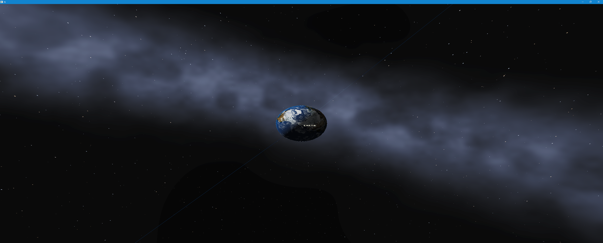
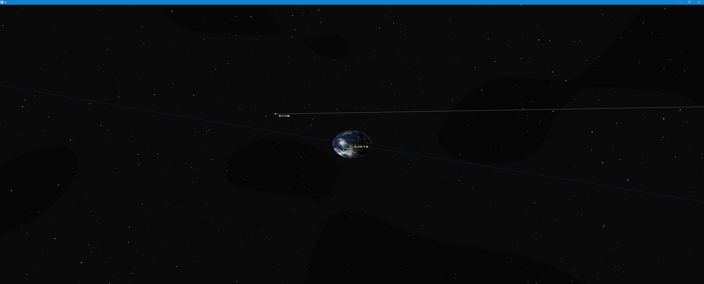
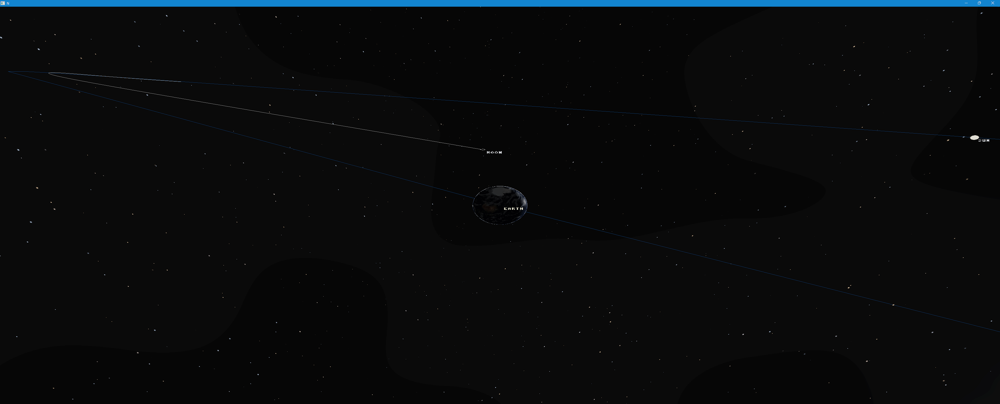
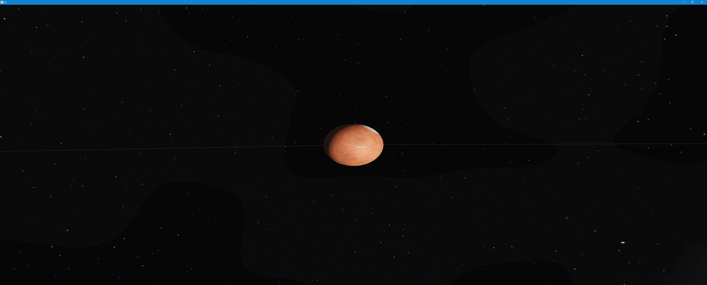
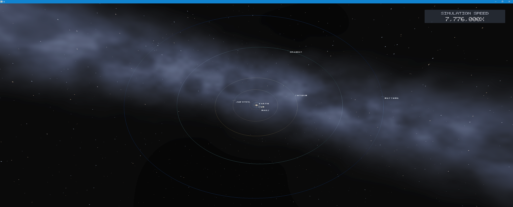

# NovaCore

**A precision space-simulation and game-engine project built for continuous planetary scale.**



<p align="center">
  
  
</p>
<p align="center">
  
  
</p>

NovaCore is an experimental space-simulation and game-engine project built from the ground up for enormous differences in scale. It combines deterministic simulation authority, high-precision reference frames, real planetary data, and a native Vulkan renderer.

The goal is simple to describe, even if it is difficult to build:

> **Create one continuous simulation capable of taking you from a planetary surface through launch, atmosphere, orbit, and interplanetary space.**

NovaCore combines astronomical simulation, planetary rendering, large-scale coordinate systems, terrain, real planetary data, and a custom Vulkan renderer into a single engine.

## What can NovaCore do today?

NovaCore can already:

- Simulate the major bodies of the Solar System and their motion.
- Start from the current real-world time and accelerate simulation time from 0.1× to 7,776,000×.
- Render planets and moons across astronomical distances.
- Approach planetary surfaces while maintaining numerical precision.
- Transition between global planetary rendering and near-surface terrain rendering.
- Stream real NASA/NOAA Earth imagery and elevation data.
- Retain body-fixed Earth geography through `SurfaceAnchor`, terrain-aware camera, and anchored surface-object foundations.
- Place and reevaluate a deterministic Florida launch-site proof on the physical Earth terrain authority.
- Light planets using the simulated position of the Sun, producing coherent day/night boundaries.
- Render distinct planetary appearances, Saturn's rings, orbital paths, labels, and markers.
- Explore the Solar System using Solar Map and free 3D camera modes.
- Evaluate fixed-attitude and rigid-body spacecraft rotation, torque transactions, and a bounded SAS guidance proof without presenting a finished flight game.
- Reproduce simulation and rendering results deterministically for testing and validation.

## The goal

NovaCore is being developed toward a simulation where scale does not define the boundaries of the experience:

**Surface → Launch → Atmosphere → Orbit → Interplanetary space**

Rather than treating these as completely separate environments, NovaCore is being designed so they can exist within the same underlying simulation.

NovaCore is still under active development. Production atmospheres, close volumetric clouds, physical oceans, weather, complete spacecraft flight gameplay, colonies, maneuver planning, and navigation systems remain future work.

## A simple design rule

NovaCore is built around one important principle:

> **Simulation owns truth. Rendering owns presentation.**

In plain language, the simulation decides where objects really are, how large they are, how time is progressing, and how the universe is behaving. The renderer decides how that information should look on screen.

Keeping those responsibilities separate allows visual systems to become more sophisticated without changing the underlying simulated universe.

---

# Technical overview

The rest of this README goes deeper into NovaCore's current engineering state, architecture, renderer, planetary systems, validation, and limitations.

NovaCore currently combines a C# simulation core with a native Vulkan renderer, compact DE440-validated Solar propagation, camera-relative high-precision transport, GPU-driven planetary rendering, HDR presentation, procedural planetary materials, Saturn rings, and an interactive Solar map.

## Current technical capabilities

### Celestial simulation

- **DE440-validated compact Solar runtime** — `SolCompact-DE440Validated-v3` evaluates the current Solar model without loading CSPICE or DE440 kernels at runtime.
- **Current-real-world UTC startup** sampled once, then governed exclusively by exact `SimulationInstant` and `SimulationClock` authority.
- **Deterministic arbitrary-time evaluation** with 15 ordered simulation-speed presets from 0.1× through 7,776,000×.
- **Compact lunar corrections** — generic secular plus bounded periodic corrections improve the Moon while retaining a lightweight analytical runtime.
- **Authoritative planetary orientation** — direct-epoch axial orientation and rotation remain independent of the camera and rendering cadence.
- **High-precision lunar orientation** — a compact, kernel-free DE440 lunar frame pack covers 1900–2100, with explicit deterministic `IAU_MOON` fallback outside validated coverage.
- **Zero-allocation warmed celestial evaluation**, measured below 25 µs for all ten currently presented Solar bodies on the development machine.
- **NCPE v2** artifact reconstruction and deterministic definition/hash verification.

### Rendering and presentation

- **Native Vulkan renderer** with double-precision camera-relative subtraction before GPU float transport.
- **GPU-driven planets** with a shallow relaxed cube-sphere for orbital/global presentation and a persistent, body-fixed spherical-billboard surface for the near field.
- **Distant/detail handoff** sharing authoritative physical center, radius, material identity, and Solar-light direction.
- **Correct body-fixed handoff conventions** across detailed, transitional, and distant paths, including a dedicated outward-winding convention for the shared distant sphere.
- **FP16 HDR scene color** with fixed exposure and ACES-style tone mapping.
- **Procedural deep-space background** and dedicated stellar-Sun presentation with controlled HDR corona/glow.
- **Evaluated-Sun lighting** for coherent planetary day/night terminators.
- **Generic procedural planet materials** with distinct presentations for Mercury, Venus, Earth, Moon, Mars, Jupiter, Saturn, Uranus, and Neptune.
- **Generic ring presentation**, currently demonstrated by Saturn.
- **NASA/NOAA terrain-v5 Earth surface authority** using canonical east-positive, right-handed, patch-aligned relaxed cube-sphere `.nccube` records and a checked topology-neutral CPU elevation oracle.
- **Persistent global and local terrain residency** using the `earth-surface-v5` L0-L2 hierarchy, optional `earth-local-v2` payload refinement, coherent parent/child ownership, and persistent production spherical-refinement tiers.
- **Surface-relative foundations** with terrain-aware camera clearance, immutable body-fixed `SurfaceAnchor` identity, anchored surface objects, and a deterministic Florida launch-site proof.
- **Solar Map and Free 3D camera modes** with deterministic home framing and body focus.
- **Authoritative orbit visualization** sourced from the same `CelestialSystemEvaluator` used for body motion.
- **Deterministic label/marker hierarchy** with collision suppression, distance-aware presentation, and focused-body clutter reduction.

### Validation

NovaCore treats correctness tooling as part of the engine rather than as presentation behavior:

- CPU-reference / GPU planetary parity validation.
- Vulkan validation-layer verification.
- Deterministic celestial and topology hashes.
- Camera/reference-frame precision tests.
- Native, managed, Solar-scene, Earth-LOD, resize, and triangle regression coverage.

The recovered Desktop baseline has a 1,025-sample far→near→far continuous-visibility regression spanning 10 m to 100,000 km. Accepted Vulkan runs at 50,000, 30,000, 20,000, 10,000, 3,000, and 700 km retained the six global terrain roots and reported zero validation errors. Focused regressions also verify mixed-LOD geographic/terrain authority and prove that camera drag cannot mutate Earth body orientation or body-fixed geography.

The CPU reference/parity path is a development and regression oracle; the intended production planetary path remains GPU-driven.

## How NovaCore is structured

```text
Offline astronomical truth
        │
        ▼
JPL/NAIF DE440 + CSPICE
        │  validation only
        ▼
Compact versioned Solar definitions

Runtime simulation
SimulationClock
        ↓
CelestialSystemEvaluator
        ↓
Parent-relative / reference-frame resolution
        ↓
Immutable presentation snapshots
        ↓
Native Vulkan renderer
        ↓
HDR / GPU planets / materials / rings / overlays
```

The runtime never needs to stream DE440 kernels or call CSPICE. High-authority astronomy is used offline to measure and validate compact deterministic models. The lunar orientation path is likewise extracted offline from official NAIF/JPL DE440 kernels into a checked 3.5 MB residual pack; normal evaluation remains allocation-free and kernel-independent.

For exceptional future precision requirements, a bounded sampled or Chebyshev ephemeris layer can be introduced where measurement proves it necessary rather than becoming the default representation for every body.

## Run the Solar System

From the repository root on a configured Windows development environment:

```powershell
dotnet run --project tools/NovaCore.AssetTool -- status earth-surface-v5
dotnet run --project tools/NovaCore.AssetTool -- status earth-local-v2
# On a fresh clone, explicitly populate the verified runtime cache:
dotnet run --project tools/NovaCore.AssetTool -- build earth-surface-v5
dotnet run --project tools/NovaCore.AssetTool -- build earth-local-v2
dotnet run --project samples/NovaCore.Triangle/NovaCore.Triangle.csproj -c Debug -- --scene=sol
```

Heavy generated terrain payloads are not ordinary Git blobs and are not copied
into each build output. The tracked manifests identify the required global and
optional local immutable bytes; the explicit asset tool verifies, fetches when
a remote is configured, or deterministically regenerates them into an ignored
content-addressed cache.
Normal runtime never downloads terrain implicitly. See
[Production terrain assets](docs/terrain-assets.md).

After it has already been built:

```powershell
dotnet run --project samples/NovaCore.Triangle/NovaCore.Triangle.csproj -c Debug --no-build -- --scene=sol
```

Current Solar-scene controls include mouse drag for free orbiting, mouse wheel zoom, number-key body focus, `.` / `,` simulation-rate changes, Space pause/resume, and `R` to return to the deterministic Solar Map home view.

## Current planetary baseline

The current Desktop baseline uses one production-owned Earth surface architecture from Solar overview to the near field:

- canonical right-handed body-fixed geography: +Y north, +X at longitude zero, and positive/east longitude toward -Z;
- deterministic `earth-surface-v5` distribution and optional `earth-local-v2` refinement addressed by `body / terrain-version / face / level / x / y`;
- conservative opaque global coverage that remains authoritative until a complete refinement transaction is ready, so refinement cannot leave an unowned visible region;
- coherent global/refinement material addressing, including mixed-payload and cross-face fragments resolved from the represented body-fixed geography;
- outward production topology with Vulkan front-face state matched to the validated projected winding;
- explicit host-to-compute publication synchronization and runtime terrain-version identity instead of stale hard-coded assumptions;
- FP64 camera-relative reconstruction, body-fixed surface anchors, and anchored-object evaluation downstream of unchanged celestial authority.

The former equirectangular virtual-texture owner and per-frame radial terrain generator are retired. The current renderer is a stable architectural and reference baseline, not the final visual target: deeper continuous refinement, richer surface materials, and gameplay-scale environmental detail remain active development.

## Accuracy and current scope

`SolCompact-DE440Validated-v3` is intended for Solar presentation, deterministic time warp, and approximate translunar gameplay. It is **not** JPL DE440 playback and should not be described as a precision lunar-navigation ephemeris.

The new high-precision Moon orientation improves pole, prime-meridian, and physical-libration presentation; it does not improve lunar translation. Precision translunar targeting, lunar orbit insertion, close lunar navigation, or other requirements that exceed the compact translational model's measured accuracy will receive a dedicated higher-fidelity ephemeris layer when those requirements exist.

NovaCore now has a production-owned terrain architecture, but its terrain-v5 global payload is still shallow. The former provisional atmosphere/cloud renderer has been retired. Production atmosphere, clouds, water/coastlines, physical oceans, weather, complete spacecraft flight gameplay, colonies, maneuver planning, and SOI/patched-conic navigation are not yet implemented.

## Roadmap

**Next planetary frontier**

Production-quality continuous terrain and seamless refinement → close-ground material/detail quality → atmosphere/cloud reconstruction → water and coastline systems → GPU-driven local environmental detail → surface, launch, and landing gameplay.

**Future flight and navigation**

Extended local/reference-frame transitions → SOI/patched-conic policy → complete spacecraft force/torque and flight integration → maneuver planning and navigation → higher-fidelity ephemerides wherever measured accuracy requires them.

The goal is to add those systems without weakening the existing authority boundary between simulation and presentation.

## Build and test

Windows development currently uses .NET, MSVC x64, Ninja/CMake, and Vulkan.

```powershell
cmake -S native/NovaCore.Native -B build/native-ninja -G Ninja
cmake --build build/native-ninja --config Debug

dotnet build NovaCore.sln -c Debug
dotnet run --project tests/NovaCore.Graphics.Tests -c Debug
```

See the engineering documentation for the complete scoped build, validation, and architecture requirements.

## Documentation

- [Architecture](docs/architecture.md)
- [Current engineering state](docs/NOVACORE_CURRENT_STATE.md)
- [Planetary rendering](docs/planetary-rendering.md)
- [Production terrain assets](docs/terrain-assets.md)
- [Celestial simulation](docs/celestial-simulation.md)
- [Ephemeris dataset format](docs/ephemeris-dataset-format.md)
- [Ephemeris runtime loader](docs/ephemeris-runtime-loader.md)
- [NAIF source adapter](docs/naif-source-adapter.md)
- [Build on Windows](docs/build-windows.md)

---

**NovaCore is a work in progress.** The repository documents implemented systems and measured limitations explicitly; roadmap items are not presented as completed features.
