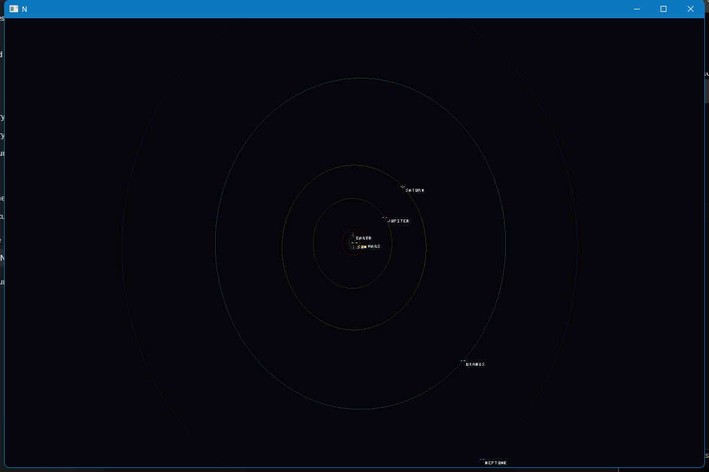

# NovaCore

**A deterministic, true-scale space simulation engine with a custom Vulkan renderer.**



NovaCore is an experimental space-simulation engine built around a simple rule:

> **Simulation owns truth. Rendering owns presentation.**

Celestial mechanics, reference frames, physical radii, and simulation time remain authoritative in the managed simulation. The renderer consumes immutable presentation state and is free to add GPU LOD, materials, lighting, labels, rings, and other visual systems without changing the underlying universe.

NovaCore currently combines a C# simulation core with a native Vulkan renderer, compact DE440-validated Solar propagation, camera-relative high-precision transport, GPU-driven planetary rendering, HDR presentation, procedural planetary materials, Saturn rings, and an interactive Solar map.

## What works today

### Celestial simulation

- **DE440-validated compact Solar runtime** — `SolCompact-DE440Validated-v3` evaluates the current Solar model without loading CSPICE or DE440 kernels at runtime.
- **Deterministic arbitrary-time evaluation** with immutable definitions and exact `SimulationClock` state.
- **50,000× time-warp validation** with deterministic body motion and presentation updates.
- **Compact lunar corrections** — generic secular plus bounded periodic corrections improve the Moon while retaining a lightweight analytical runtime.
- **Zero-allocation warmed celestial evaluation**, measured below 25 µs for all ten currently presented Solar bodies on the development machine.
- **NCPE v2** artifact reconstruction and deterministic definition/hash verification.

### Rendering and presentation

- **Native Vulkan renderer** with double-precision camera-relative subtraction before GPU float transport.
- **GPU-driven adaptive cube-sphere planets** with deterministic mixed-level LOD, neighbor balancing, edge stitching, horizon culling, compaction, and indirect drawing.
- **Distant/detail handoff** sharing authoritative physical center, radius, material identity, and Solar-light direction.
- **FP16 HDR scene color** with fixed exposure and ACES-style tone mapping.
- **Procedural deep-space background** and dedicated stellar-Sun presentation with controlled HDR corona/glow.
- **Evaluated-Sun lighting** for coherent planetary day/night terminators.
- **Generic procedural planet materials** with distinct presentations for Mercury, Venus, Earth, Moon, Mars, Jupiter, Saturn, Uranus, and Neptune.
- **Generic ring presentation**, currently demonstrated by Saturn.
- **Solar Map and Free 3D camera modes** with deterministic home framing and body focus.
- **Authoritative orbit visualization** sourced from the same `CelestialSystemEvaluator` used for body motion.
- **Deterministic label/marker hierarchy** with collision suppression, distance-aware presentation, and focused-body clutter reduction.

### Validation

NovaCore treats correctness tooling as part of the engine rather than as presentation behavior:

- CPU-reference / GPU planetary parity validation.
- Vulkan validation-layer verification.
- Deterministic celestial and topology hashes.
- Camera/reference-frame precision tests.
- Native, managed, Solar-scene, Earth-LOD, resize, and triangle regression coverage.

The CPU reference/parity path is a development and regression oracle; the intended production planetary path remains GPU-driven.

## Why NovaCore?

NovaCore is exploring how far a compact custom engine can push seamless space simulation without making the renderer the owner of simulation truth.

```text
Offline astronomical truth
        │
        ▼
JPL/NAIF DE440 + CSPICE
        │  validation only
        ▼
Compact versioned Solar definitions

Runtime simulation
SimulationClock
        ↓
CelestialSystemEvaluator
        ↓
Parent-relative / reference-frame resolution
        ↓
Immutable presentation snapshots
        ↓
Native Vulkan renderer
        ↓
HDR / GPU planets / materials / rings / overlays
```

The runtime never needs to stream DE440 kernels or call CSPICE. High-authority astronomy is used offline to measure and validate compact deterministic models.

For exceptional future precision requirements, a bounded sampled or Chebyshev ephemeris layer can be introduced where measurement proves it necessary rather than becoming the default representation for every body.

## Run the Solar System

From the repository root on a configured Windows development environment:

```powershell
dotnet run --project samples/NovaCore.Triangle/NovaCore.Triangle.csproj -c Debug -- --scene=sol
```

After it has already been built:

```powershell
dotnet run --project samples/NovaCore.Triangle/NovaCore.Triangle.csproj -c Debug --no-build -- --scene=sol
```

Current Solar-scene controls include mouse drag for free orbiting, mouse wheel zoom, number-key body focus, `.` / `,` simulation-rate changes, Space pause/resume, and `R` to return to the deterministic Solar Map home view.

## Current checkpoint — Milestone 10B-1

Milestone 10B-1 establishes NovaCore's first cohesive Solar presentation foundation:

- HDR scene-color and tone-mapping path
- procedural deep space
- dedicated stellar Sun
- evaluated-Sun planetary lighting
- generic planet materials
- Saturn ring presentation
- Solar Map / Free 3D camera behavior
- hierarchical orbit, label, and marker presentation
- GPU planetary LOD preserved underneath the new visual stack

All of this remains downstream of the authoritative celestial simulation.

## Accuracy and current scope

`SolCompact-DE440Validated-v3` is intended for Solar presentation, deterministic time warp, and approximate translunar gameplay. It is **not** JPL DE440 playback and should not be described as a precision lunar-navigation ephemeris.

Precision translunar targeting, lunar orbit insertion, close lunar navigation, or other requirements that exceed the compact model's measured accuracy will receive a dedicated higher-fidelity layer when those gameplay requirements exist.

NovaCore is still under active development. It does **not** yet provide production terrain, atmospheric scattering, volumetric clouds, ocean simulation, weather, spacecraft gameplay, colonies, maneuver planning, or SOI/patched-conic navigation.

## Roadmap

**Next visual frontier**

Atmosphere and cloud presentation → production/lawfully authored surface detail and elevation on the proven surface-scale renderer → additional planetary effects and polish.

**Future flight and navigation**

Local/floating reference-frame transitions → SOI/patched-conic policy → spacecraft force/torque dynamics → maneuver planning and navigation → higher-fidelity ephemerides wherever measured accuracy requires them.

The goal is to add those systems without weakening the existing authority boundary between simulation and presentation.

## Build and test

Windows development currently uses .NET, MSVC x64, Ninja/CMake, and Vulkan.

```powershell
cmake -S native/NovaCore.Native -B build/native-ninja -G Ninja
cmake --build build/native-ninja --config Debug

dotnet build NovaCore.sln -c Debug
dotnet run --project tests/NovaCore.Graphics.Tests -c Debug
```

See the engineering documentation for the complete scoped build, validation, and architecture requirements.

## Documentation

- [Architecture](docs/architecture.md)
- [Current engineering state](docs/NOVACORE_CURRENT_STATE.md)
- [Planetary rendering](docs/planetary-rendering.md)
- [Celestial simulation](docs/celestial-simulation.md)
- [Ephemeris dataset format](docs/ephemeris-dataset-format.md)
- [Ephemeris runtime loader](docs/ephemeris-runtime-loader.md)
- [NAIF source adapter](docs/naif-source-adapter.md)
- [Build on Windows](docs/build-windows.md)

---

**NovaCore is a work in progress.** The repository documents implemented systems and measured limitations explicitly; roadmap items are not presented as completed features.
