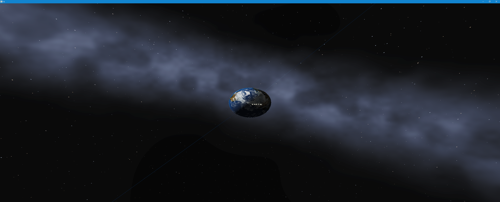
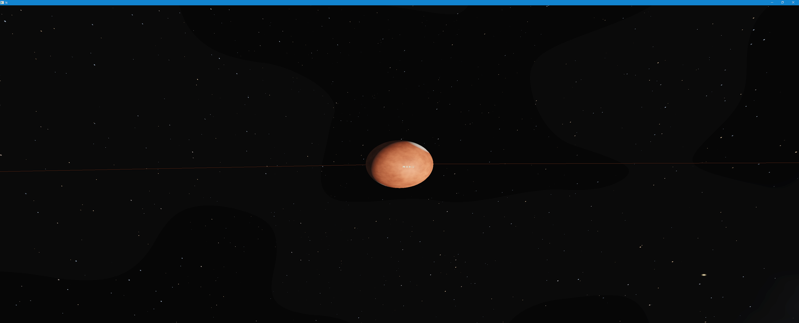
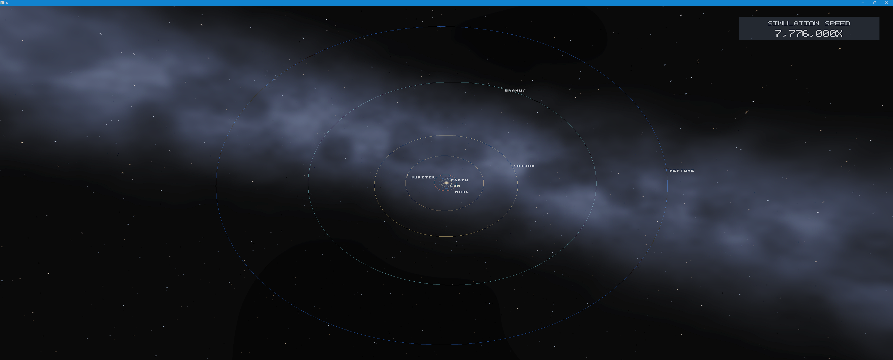

# NovaCore

**A precision space-simulation and game framework by Albatronic Productions.**

NovaCore is a custom-built foundation for exploring planetary worlds and flying
spacecraft across vast distances. It is being developed toward one continuous
experience: leave the surface, travel through space, and return to land.



*Earth against the Milky Way in an earlier development build.*

**In active development.** Working simulation systems are available through source
builds and development scenarios. There is no packaged player release yet.

[Working today](#working-today) · [Project direction](#where-novacore-is-going) ·
[Source access](#trying-novacore-today) · [Technical documentation](#for-developers)

## A simulation across scales

Spaceflight connects very different scales: the ground beneath a spacecraft, a
planet's horizon, and the distances between worlds. NovaCore is built around
preserving that sense of scale, with high-precision positioning and a simulation
in which motion, rotation and fuel have physical consequences.

The goal is a cohesive space simulation where planetary exploration and spacecraft
flight belong to the same journey. Today's working systems are the foundations;
the full player experience is still being assembled.

## Current unbanked generation — feature freeze

**Project Control accepted the frozen candidate for M16.0 bank preparation; it remains UNBANKED.**
See the [exact manual bank inventory and cleanup disposition](docs/engineering-evidence/m16-bank-preparation/README.md).
The [current recorder-storage candidate supplement](docs/engineering-evidence/minimum-recorder-bounded-storage/README.md)
reseals the authorized final storage correction. The [campaign bank-candidate report](docs/engineering-evidence/performance-150fps/bank-candidate.md)
consolidates accepted engineering/integration outcomes, exact identities and
reproduction. Stable 150 FPS remains open; historical blackout cause is unresolved;
Player/public PASS is unassigned. The milestone is assigned for preparation; no bank is declared.
MinimumRecorder remains temporary qualification infrastructure while blackout
causality is unresolved. It is not accepted as permanent public-player architecture;
public release requires Project Control's explicit instrumentation classification.
Internal startup normally maintains the bounded recorder window, reserves a full
session, starts recording, then launches the game. Preventive maintenance is at
400 MiB; the hard total runtime cap is 512 MiB. Unrecorded play is an exceptional
preservation fallback and cannot satisfy recorder-required qualification.

The unified development application is `tools/NovaCore.App/bin/Release/net10.0-windows/NovaCore.exe`.
It owns startup/configuration → Solar game → construction → Florida launch →
physical flight/control → return to the retained construction document.
The stabilization/bank gauntlet is documented in
[the current evidence package](docs/engineering-evidence/stabilization-bank-gauntlet/README.md).
The [Florida pad authority revision](docs/engineering-evidence/florida-pad-authority/README.md)
provides one current single-layer slab throughout the unified lifecycle.
The [RCS canonicalization record](docs/engineering-evidence/rcs-canonicalization/README.md)
integrates the qualified scalable actuator architecture into `E:\NovaCore`;
canonical qualification and Project Control disposition are recorded there.
The [scalable launch-support revision](docs/engineering-evidence/scalable-launch-support/README.md)
replaces the generic four-foot envelope with actual authored contact/load ownership;
its final evidence records the current candidate disposition.
Project Control alone may manually bank M16.0 after reviewing the fail-closed inventory.

Latest [performance and recorder qualification](docs/engineering-evidence/performance-150fps/README.md):
Stage A CPU/contact closure is accepted; recorder storage warning and safe maintenance
pass Debug/Release. Stable 150 FPS remains **OPEN**: the final bounded GPU payoff
gate did not establish a sufficient safe correction, so no GPU change or extra
native run was made. The canonical candidate is frozen/unbanked; blackout cause
remains unresolved and Player acceptance remains on hold.

Construction uses generic part instances, connectors, deterministic transactions,
save/load and 1×/2×/4×/8× symmetry. Short/long craft are witnesses, not depth limits.
The current document capacity is 1,024 parts / 4 MB. Flight admission remains a
separate bounded physical profile; editable craft are not automatically flyable.
See [known limitations](docs/KNOWN_LIMITATIONS.md) and [build/run instructions](docs/build-windows.md).

## Working today

**Current banked milestone: [M15.5 — Player Flight Controls](https://github.com/AlbatronicProductions/NovaCore/tree/m15.5-player-flight-controls).**
The current production foundation integrates the canonical stock SRV-01 through
retained and powered support, bounded contact-to-free-flight ownership transfer in
its qualified fixed-slab domain, finite propulsion/resource mechanics, and
authenticated rotating-Florida support. **FL Launchpad → Play** places the stock
spacecraft on a shared physical/visible launch slab while preserving Solar-system
exploration, planet focus, overview, zoom and camera navigation.

M15.4 adds a unified active-vessel camera, and M15.5 qualifies Z/X engine and
WASD/QE attitude controls through physical actuators in a bounded free-flight
development route. Connected Florida player launch belongs to the later unbanked
generation above. These banks do not qualify an Earth launch stack or orbit
insertion, SAS/navball/autopilot, production lighting/shadows, or
atmosphere/aerodynamics/reentry. See the
[current engineering state](docs/NOVACORE_CURRENT_STATE.md).

- **Earth exploration:** move the camera from orbital views down toward terrain,
  with Sun-driven day and night, NASA/NOAA source imagery and elevation, and USGS
  regional detail around Florida.
- **Solar System views:** explore planets and moons, see Saturn's rings, and
  change the simulation rate to watch celestial motion unfold.
- **Spacecraft motion and propulsion:** simulate translation and rotation under
  forces and torques. Powered flight consumes finite propellant, changes spacecraft
  mass, and continues into coasting when the fuel runs out.
- **Surface interaction foundations:** explore the authenticated Florida site with
  stock SRV-01 supported on one physical/visible slab; separate qualification scenes
  exercise retained contact and bounded ownership transfer to free flight.
- **Finite-fuel retained powered contact:** apply finite-fuel propulsion while a
  body remains supported, with physical state, remaining fuel, mass and actual
  actuator state published together. This bounded contact path is separate from
  powered free flight.

These capabilities are exercised in bounded development scenarios. The original
powered-flight cube and SRV-01 control route remain separate historical witnesses.
The newer unified application connects construction to bounded Florida flight;
complete terrain landing remains future work.

## Screenshots

<p align="center">
  
  
</p>

*Mars and the Solar System viewed with accelerated time. These earlier development
captures show the project's planetary scale; terrain, lighting and presentation
continue to evolve. They do not depict finished spacecraft or atmosphere systems.*

## Where NovaCore is going

**Surface → Launch → Atmosphere → Orbit → Interplanetary flight → Return → Landing**

That complete journey is the long-term goal. The current unbanked generation
connects construction to bounded rotating-Florida departure and physical controls.
Orbital vehicles, atmospheric flight, reentry and controlled landing remain future
work. Feature expansion is frozen pending Project Control disposition.

The intended player experience is straightforward: download a packaged build,
launch an executable, and enter the simulation. The unified development application
already owns the continuous player lifecycle; a standalone distribution remains
future work. No release date is promised.

## Trying NovaCore today

Current access is for developers and technically comfortable source builders on
**Windows 11, x64**. Use the unified NovaCore.exe for the player lifecycle.
The separate legacy launcher remains available for focused engineering scenarios.

Start with the [Windows build guide](docs/build-windows.md) and
[terrain setup guide](docs/terrain-assets.md). Earth and Solar System scenes
require **both the global and Florida regional terrain packages**, including when
starting away from Florida.

<details>
<summary>Source build and required Earth data</summary>

Install the toolchain in the build guide, plus Git with Git LFS, Ninja and
PowerShell 7. Terrain generation uses Python with **NumPy 2.3.5** and
**Pillow 11.3.0**, pinned in
[requirements.txt](tools/earth_data/requirements.txt). If needed, set
`NOVACORE_PYTHON` to that interpreter's path.

The unbanked App sources are not yet in the remote M15.5 checkout. Use the exact
prospective source set from the stabilization record until Project Control banks
it; a fresh clone of current remote HEAD cannot reproduce this candidate. After
banking, clone the approved revision and resolve Git LFS. From that source root
in a Visual Studio x64 Developer PowerShell. In an actual clone, first run
`git lfs install` and `git lfs pull`; skip those commands for the sealed export,
which already contains resolved LFS bytes and has no Git remote:

```powershell
cmake -S native/NovaCore.Native -B build/native-ninja-release -G Ninja -DCMAKE_BUILD_TYPE=Release
cmake --build build/native-ninja-release
dotnet build NovaCore.sln -c Release

dotnet run --project tools/NovaCore.AssetTool -- build earth-surface-v5
dotnet run --project tools/NovaCore.AssetTool -- verify earth-surface-v5
pwsh tools/earth_data/acquire_florida_m12.ps1
dotnet run --project tools/NovaCore.AssetTool -- build earth-florida-m12
dotnet run --project tools/NovaCore.AssetTool -- verify earth-florida-m12
& ./tools/NovaCore.App/bin/Release/net10.0-windows/NovaCore.exe
```

Prepare both terrain packages before starting the unified application.
Packages are generated and verified locally; no prebuilt terrain download is
currently configured, and runtime does not download missing assets. See the
[terrain guide](docs/terrain-assets.md) for cache setup and recovery.

</details>

<details>
<summary>Development and diagnostic scenarios</summary>

These scenarios exercise specific NovaCore systems during development. They are
not intended as the final player flow or a list of finished game modes.

- **Planetary exploration:** New Earth Renderer and Solar System Overview open
  planetary views. **FL Launchpad → Play** opens the shared Florida slab scenario
  with supported stock SRV-01 and Solar navigation, without liftoff.
- **Powered flight:** Development - Powered Free Flight shows a fixed burn, fuel
  exhaustion and coast. Wait for READY, then press Space. Camera movement does not
  pilot the craft. This scene does not require Earth terrain packages.
- **SRV-01 spacecraft:** SRV-01 — Reusable Spacecraft Parts demonstrates the
  assembled vehicle, gimbaled main engine, RCS and nozzle-attached exhaust.
  Wait for READY, then press Space to start the recorded sequence.
- **Contact:** the centered and tilted contact scenes show bounded box-and-slab
  interaction; they do not implement spacecraft landing on Earth terrain.

For the powered-flight scene directly, after building Release:

```powershell
dotnet run --project samples/NovaCore.Triangle -c Release -- --scene=powered-free-flight
```

For the banked SRV-01 spacecraft scenario:

```powershell
dotnet run --project samples/NovaCore.Triangle -c Release -- --scene=stock-assembly
```

The banked powered-contact scenario has a separate direct route:

```powershell
dotnet run --project samples/NovaCore.Triangle -c Release -- --scene=powered-contact
```

For powered contact, Space advances two inspection intervals, then starts live
dry continuation. The body remaining stationary on its support is expected;
camera movement does not pilot it. This path passed Debug/Release regression,
exact-zero warmed allocation contracts, retained-storage limits and integrated
frame qualification on the recorded host. This is not a universal FPS guarantee.

</details>

## For developers

NovaCore combines a C# simulation core with a native C++/Vulkan renderer. Detailed
contracts, implementation limits and reproducible evidence live in the documentation.

| Topic | Read more |
|---|---|
| Architecture and engineering principles | [Architecture](docs/architecture.md) · [Engineering rules](ENGINEERING_RULES.md) |
| Planetary rendering and data | [Renderer](docs/planetary-rendering.md) · [Terrain assets](docs/terrain-assets.md) · [Source provenance](assets/earth/PROVENANCE.md) |
| Simulation and spacecraft | [Simulation time](docs/simulation-time.md) · [Spacecraft motion](docs/spacecraft-translation.md) · [Attitude dynamics](docs/spacecraft-attitude.md) |
| Powered flight | [Physics contract](docs/engineering-evidence/segmented-powered-free-flight/physics-contract.md) · [Qualification](docs/engineering-evidence/segmented-powered-free-flight/final-qualification.md) |
| M15.5 player flight controls | [Qualification and limits](docs/engineering-evidence/player-flight-controls-gauntlet/README.md) · [Banked source](https://github.com/AlbatronicProductions/NovaCore/tree/m15.5-player-flight-controls) |
| M15.4 active-vessel camera | [Qualification and limits](docs/engineering-evidence/active-vessel-camera/README.md) · [Banked source](https://github.com/AlbatronicProductions/NovaCore/tree/m15.4-unified-active-vessel-camera) |
| M15.3 supported-flight foundation | [Current scope and limits](docs/NOVACORE_CURRENT_STATE.md) · [Banked source](https://github.com/AlbatronicProductions/NovaCore/tree/m15.3-canonical-srv01-florida-supported-flight-foundation) |
| M15.2 reusable SRV-01 spacecraft | [Qualification, limits and reproduction](docs/engineering-evidence/srv01-production-integration/README.md) · [Banked source](https://github.com/AlbatronicProductions/NovaCore/tree/m15.2-srv01-reusable-production-spacecraft-integration) |
| M15.1 retained powered contact | [Qualification history, limits and reproduction](docs/engineering-evidence/powered-contact-bank-candidate/README.md) · [Banked source](https://github.com/AlbatronicProductions/NovaCore/tree/m15.1-finite-fuel-retained-powered-contact) |
| Development state and history | [Engineering overview](docs/NOVACORE_CURRENT_STATE.md) · [Evidence index](docs/engineering-evidence/README.md) · [Powered-flight source checkpoint](https://github.com/AlbatronicProductions/NovaCore/tree/m15.0-segmented-powered-free-flight) |

Historical reports retain their original scope and status; the linked source
checkpoint identifies the published powered-flight implementation.

## Feedback and license

Useful bug reports include the build/commit, hardware, reproduction steps and logs.
For code contributions, read the [engineering rules](ENGINEERING_RULES.md) and
the intentional-contribution terms in [LICENSE](LICENSE), section 12.

NovaCore is source-available under the [NovaCore Source-Available License 1.0](LICENSE).
Original NovaCore material is owned by Tyler Alba, operating under the
project/developer name Albatronic Productions, unless otherwise noted.
Personal use and private personal modifications are permitted. Independent
creators may monetize their content and keep its revenue under the license.
See [NOTICE](NOTICE.md), [licensing](LICENSING.md), the
[Creator Content Policy](docs/legal/CREATOR-CONTENT-POLICY.md),
[Modding Policy](docs/legal/MODDING-POLICY.md) and
[commercial licensing](docs/legal/COMMERCIAL-LICENSING.md) for rights and limits.

Bundled BEPU retains its own [Apache-2.0 license](external/bepu/2.5.0-beta.29/LICENSE.txt)
and [dependency provenance](external/bepu/README.md). NASA, NOAA and USGS source
credits and data boundaries remain in [data provenance](assets/earth/PROVENANCE.md).
