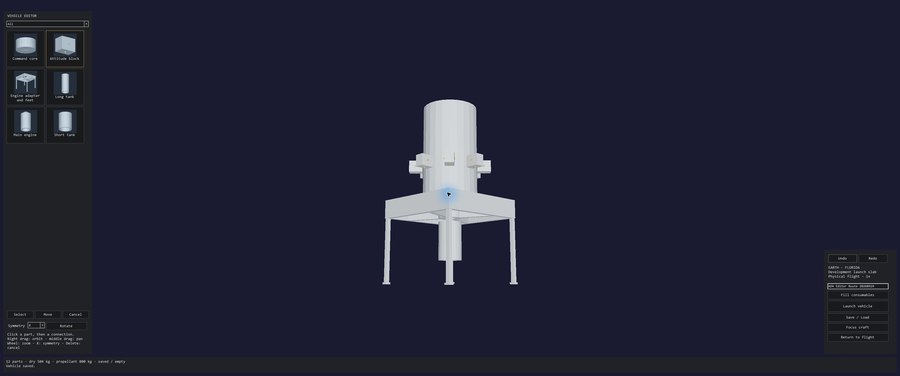

# NovaCore

**A precision planetary spaceflight sandbox, built toward seamless journeys from surface to space.**

Build a modular spacecraft, launch from Florida, and fly with physical propulsion
and attitude thrusters. Return to terrain or the pad, settle, and relaunch within
the current flight limits. NovaCore is developed by **Albatronic Productions**.

**Active development · Windows 11 x64 source build · No packaged download yet**

[Try NovaCore](#try-novacore) · [What works today](#what-you-can-do-now) ·
[Controls](#controls) · [Development status](#development-status)



*Vehicle Editor presentation now banked in M16.2; captured September 29, 2026.
Actual application capture; spacecraft art and interface are still evolving.*

## What you can do now

**Build → save/load → launch from Florida → fly → return and settle → relaunch**

- **Enter one fullscreen application.** Configure the session, follow real loading
  progress, then enter gameplay. Menus and the Vehicle Editor overlay the scene
  while the renderer keeps the full viewport.
- **Build and revise spacecraft.** Connect cores, tanks, engines, support adapters
  and RCS attitude thrusters. Use symmetry, undo/redo and saved craft designs.
- **Launch and fly.** Fill tanks, charge batteries and launch a compatible craft.
  Control the main engine and attitude thrusters while finite fuel and changing
  mass affect flight.
- **Make physical contact.** Return to terrain or the pad, slide, rock, settle,
  use grounded controls and relaunch within the supported flight and impact limits.
- **Explore planetary worlds.** View planets, moons, Saturn's rings and Sun-driven
  day and night. Move the camera from space down toward Earth's terrain. Slow
  exploration to 0.1× or pause while the view and interface remain responsive.

Craft construction, flight and returning to your design share one application.
The current build supports a bounded flight domain; it does not yet provide a
complete orbital mission or unrestricted landing anywhere on Earth.

## Try NovaCore

Current access requires a **Windows 11 x64 source build** and local terrain setup.
There is no installer or ready-to-play binary release.

1. Follow the [Windows build guide](docs/build-windows.md) for source access, resolve
   Git LFS assets and build the application. Prepare **both global Earth and
   Florida terrain packages** using the [terrain guide](docs/terrain-assets.md).
   No prebuilt terrain download is currently configured.
2. From the prepared repository root, run:

   ```powershell
   & ./tools/NovaCore.App/bin/Release/net10.0-windows/NovaCore.exe
   ```

3. In fullscreen **Configuration**, choose the session and display settings,
   then **START NOVACORE**. The dedicated **Loading** screen shows preparation
   progress and selected-GPU memory before gameplay is ready. Explore the Solar
   System or choose **Esc → New Vehicle** to build a craft.

For a first craft, place a **Command core**, then connect a **Short tank → Engine
adapter and feet → Main engine** below it. Add an **8× ring of Attitude blocks**
to the tank; use **1× symmetry** for the central stack. Finish or cancel the held
placement, choose **Fill consumables**, then **Save / Load → Save new** and
**Launch vehicle**.

New tanks and batteries start empty. If launch is refused, read **Launch details**
and fix the reported problem. A buildable design still needs valid support,
resources and attitude control. Heavier craft may burn fuel on the pad before
thrust exceeds their weight.

## Controls

Click the scene to give it keyboard focus.

| In flight | Action |
|---|---|
| **Z / X** | Main engine on / off |
| **W/S · A/D · Q/E** | Pitch · yaw · roll |
| **Mouse drag / wheel** | Orbit the view / zoom |
| **F / 1–0** | Focus the craft / celestial bodies |
| **Esc** | Open the contextual pause menu; resume, save/load flight, or return to construction |

Releasing an attitude key stops the command, not the craft's rotation. Cutting
the engine preserves motion. Camera movement does not steer the spacecraft.

Hover at the top edge to reveal the menus. One upper-right display shows the
active mode's speed or pause state.

In **exploration**, **comma / <** decreases speed and **period / >** increases it.
Below 0.1×, comma enters pause; another comma keeps it paused. Period resumes at
0.1×, then advances through the existing rates. Closing the Esc menu preserves a
user-requested pause. **Space is unbound**; staging is not implemented.

In the **Vehicle Editor**, click a part card, hover a compatible socket to preview,
then click to attach. Catalogue drag-and-drop is not implemented.
**Right-drag** orbits, **middle-drag** pans and the **wheel** zooms.
**X** cycles 1×/2×/4×/8× symmetry; **Rotate** changes the attachment angle.
**Delete** or **Cancel** cancels a held part. **Undo / Redo** revisits edits;
**Save / Load** opens your craft library.

To revisit your design from flight, choose **Esc → New vehicle / retained design**.
This opens the editor; it does not physically land the spacecraft.

## Development status

NovaCore is an **early development build**. Performance optimization, visual
stability and presentation remain ongoing work.
**M16.2 — Player Entry, Fullscreen Viewport & UI Architecture Convergence** is
banked under [m16.2](https://github.com/AlbatronicProductions/NovaCore/tree/m16.2).
It brings Configuration → Loading → Gameplay, the overlaid Vehicle Editor and
exploration pause controls together. Performance, planetary fidelity and release
qualification remain open; [known limitations](docs/KNOWN_LIMITATIONS.md) records
the retained debt. This is not a packaged public release; no release date has
been announced.

Today's limits:

- Physical spacecraft flight supports **1× and pause**. Celestial exploration has separate
  time controls; accelerated spacecraft flight is not supported.
- Craft must pass launch checks. Editing or saving a design does not make it flyable.
- Excessive or unsupported impacts stop continuation. Full damage and destruction
  are not implemented.

## Still ahead

The long-term goal is **surface → launch → atmosphere → orbit → interplanetary
flight → return → landing**.

Atmospheric flight, aerodynamics, reentry/heating, staging, a complete orbital
insertion-and-return mission, SAS, a navball and autopilot are not part of the current
playable feature set. See [current limitations](docs/KNOWN_LIMITATIONS.md) for the full scope.

## Follow and contribute

Star or watch the repository to follow development. Report reproducible problems
through [GitHub Issues](https://github.com/AlbatronicProductions/NovaCore/issues),
including your revision, hardware, steps and relevant logs or screenshots.
For code contributions, read the [engineering rules](ENGINEERING_RULES.md) and
the contribution terms in [LICENSE](LICENSE), section 12.

## Under the hood

High-precision positioning connects planetary distances with local spacecraft
motion. A deterministic C# simulation core and native C++/Vulkan renderer keep
physics separate from presentation. Earth uses NASA/NOAA imagery and elevation,
with USGS regional data around Florida.

[Architecture](docs/architecture.md) · [Engineering state](docs/NOVACORE_CURRENT_STATE.md) ·
[Change history](docs/CHANGELOG.md) · [Earth data credits](assets/earth/PROVENANCE.md)

NovaCore is **source-available** under the
[NovaCore Source-Available License 1.0](LICENSE). Read the
[licensing guide](LICENSING.md), [Creator Content Policy](docs/legal/CREATOR-CONTENT-POLICY.md),
[Modding Policy](docs/legal/MODDING-POLICY.md) and
[commercial licensing information](docs/legal/COMMERCIAL-LICENSING.md) for rights
and limits. [NOTICE](NOTICE.md) and [BEPU provenance](external/bepu/README.md)
preserve ownership and third-party credits.
