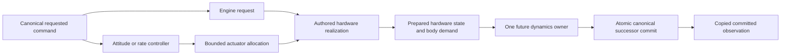

# Proposed actuator authority contract

Recommendation, not implemented capability. Initial support is one independently translating spacecraft, one command owner, fixed authored configuration and the accepted 1:1 original 60 Hz canonical schedule. Names below describe responsibilities, not prescribed API spelling.

## Five distinct meanings

| Value | Owner / meaning | Must not mean |
|---|---|---|
| Requested command | M14.22 requested state, typed target, committed ordered edges, effective epoch E and CommandRevision | Engine has ignited, thrust exists, or fuel was spent |
| Controller output | Desired body force/torque or impulse over a named interval, from canonical motion/target/control policy | Hardware can realize the request |
| Actuator command | Indexed engine demand, gimbal target or RCS valve/pulse command after allocation | Actual angle, firing duration or output |
| Realized hardware state | Engine latch/activity/availability and actual throttle/angle/pulse timers at a named frontier; controller successor remains separate | A prepared successor has committed |
| Physical output | Checked force, moment, flow and their time-domain model, with hardware/configuration/frame provenance | Dynamics has integrated or applied this output |

Each observation carries an explicit prepared-versus-committed status. A preview is conditional on its source and model assumptions, never an applied-force observation. Later committed observations are copied values with command, actuator and physical frontier/revision identities. Presentation cannot read live solver/core capabilities or use requested throttle as exhaust authority.

## Lifetime, command transition capture and cadence

Immutable binding: engine/spacecraft/command capability, authored hardware/configuration version, root/body convention, original schedule origin T0 and finite end. Mutable canonical state: actuator frontier and revision, hardware state, controller state, resource state and actuator-consumed command cursor. Private proposals cannot silently replace those authorities.

Use the original schedule `T(n)=T0+floor(n*1_000_000/60)`. Do not reset T0 on command, publication or hardware update. At each supported boundary E, complete and close M14.22's due requested transitions before preparing the following interval. Capture-attitude remains at E. No output is retroactive into already simulated time or admitted as a command to earlier debt.

The new composed owner operation must reserve bounded capture capacity **before** a command transition commits, and copy that transition with its sequence, E, kind and relevant requested successor through fixed writes under the same owner phase. No arbitrary callback or fallible post-return logging. Standalone M14.22 requested-state semantics remain unchanged; its APIs cannot be used to bypass the prepared actuator binding and then reconstruct authority from the last snapshot. A missing transition/gap makes that proposal stale; it does not trigger auto-rebind.

Capture capacity is independently bounded and declared at preparation. It cannot be inferred from the seven-slot pending queue: repeated drain/refill can produce more transitions at one boundary. On full ordinary capture storage, backpressure/refuse before command mutation. The control-loss neutralization reserve remains reserved end-to-end; ordinary traffic cannot consume it. A maximum admitted boundary batch is a bounded composed-consumer contract, not a silent reduction in the standalone command authority's lifetime.

Keep **command committed** and **actuator consumed** cursors separate. Requested commits remain committed if actuator preparation or physical publication later refuses. Keep the ordered batch available for deterministic retry; do not reissue commands or pretend their original commit failed. After all due commands drain, require successful Close and its closed-boundary/consumed-sequence witness, freezing the interval input. Future prospective commands may queue without rewriting that frozen batch. Applicability compares the frozen prefix, source/frontier and binding, not merely the most recent arbitrary observation.

Process zero-duration edges in canonical sequence at E; then realize continuous throttle/axes from the closed requested state for `[E,T(n+1))`. Opposite edges at the same E retain their ordered hardware outcomes, even when the final enabled state matches the initial state. No burn time is invented between same-epoch edges. Repeated evaluation is pure and cannot execute a pulse twice.

Initial controller and allocation evaluation occur once per canonical interval, with commands effective at its source. Hardware with a later qualified dynamic response integrates using the exact interval duration, with bounded internal events where necessary. Rendering and host partitions do not choose the cadence. Rate changes/warp outside the admitted model are explicit unsupported scope, not gain/thrust scaling. No render work is multiplied by private substeps.

## Engine realization

Use explicit small hardware state, not an omnibus lifecycle framework. First ideal model has an ignition latch **Off / Enabled**, with separate hardware availability and observed activity **Inactive / Firing / Unavailable(reason)**. Enabled at zero throttle is not a claim of nonzero firing. Availability is a hardware/configuration input; feed sufficiency is a separate resource fact or explicit qualification assumption.

- An accepted ignite edge requests an Off-to-Enabled transition at E. If unavailable, record the hardware denial and leave Off; the canonical requested command is still accepted history.
- Shutdown requests Off at E. No staged shutdown or minimum pulse is modeled by this first ideal engine.
- Requested throttle persists while Off; ignition uses the closed boundary's retained request. Off produces exact zero force/flow regardless of throttle.
- First model authors continuous proportional realization over `[0,1]`, zero minimum throttle, finite positive maximum thrust and effective exhaust speed. Zero request while Enabled gives zero output without clearing the latch. Nonzero minimum-throttle, idle, dead-zone or minimum-burn definitions are unsupported until their mapping is explicitly qualified; do not hide an arbitrary clamp.
- Ignition, shutdown and throttle realization are instantaneous in the ideal model, as an authored physical simplification. No physical spool is inferred from KSA presentation light transients. Starting/ShuttingDown states, rate limits and timers are added only for a separately authored engine model with a correctness need.
- The first authored model is restartable without a finite restart budget. A later finite restart count/igniter resource belongs to canonical hardware/resource state and the atomic interval proposal, not CommandRevision. This is not a solid motor model.
- If hardware/feed becomes unavailable in a future admitted physical model, output stops at its qualified event boundary and the model moves Off with a reason; a later new ignite edge is required. Do not silently replay an old edge when feed returns. Runtime hardware failure/repair/feed transitions are not implemented by the first preview slice.

An unavailability result is a hardware outcome, distinct from refusal of a malformed/stale proposal. NaN, invalid definition/frame, wrong source/owner, missing batch, capacity failure or arithmetic overflow refuses preparation without state mutation. A prepared engine output is still conditional until the downstream physical interval commits.

## Output and frames

For the first ideal engine, given normalized authored body force direction `d`, application point `p`, current body COM `c`, maximum force `Fmax` and realized fraction `u`:

- `F_body = u * Fmax * d`;
- `tau_body = (p-c) cross F_body`;
- `required_mdot = |F_body| / v_effective`, nonnegative, in kg/s.

The first effective exhaust speed is an authored propulsion-model parameter; it is not copied from KSA. If using Isp instead, its conversion must name the conventional reference acceleration and units, distinct from local gravity. There is no extra pressure-thrust term in this ideal model; later ambient/nozzle models replace the declared relation, not add double-counted thrust.

The demand names its exact source/target, spacecraft/configuration, source physical/actuator/resource identities, command batch, body frame, COM reference, model version and validity/status. Body output is an **interval model** (constant body wrench only for the fixed ideal actuator/COM case), not a constant inertial/root force. A source-epoch root-vector preview may be supplied and labelled as such. A future dynamics consumer evaluates `R_body_to_root(t) * F_body(t)` at its qualified stages; rotating body thrust must not be converted once and installed into the existing constant-root-force segment API. Mass/COM or gimbal changes similarly require the declared interval model.

Net force/torque is accumulated in stable authored engine/nozzle/jet order. A future aggregate includes achieved versus requested wrench/residual and per-feed required/realized flow without duplicated resource spending. Fixed-capacity indexed observations own copied data or read-only bounded storage; they never carry a live BEPU body or callable actuator updater.

## Attitude controller and allocation

Manual rotational intent, rate target and attitude target are different inputs. Future control must use the M14.22 typed target and source epoch, coherent canonical body orientation/rate, mass/inertia and declared control-frame transform. An attitude target in root coordinates must be transformed into body error consistently; a moving target frame includes its qualified frame rate. Invalid frame/target refuses or yields the explicitly specified disabled-control outcome; no silent arbitrary target substitution.

Reuse NovaCore's qualified quaternion error/target construction and Euler equations. The existing PD output is a desired body torque; its request clamp is not proof of hardware authority. If a future controller produces desired angular acceleration, convert using `tau = I*alpha + omega cross (I*omega)` under the admitted rigid-body model. Do not apply inertia twice or label angular-acceleration authority as torque.

Controller policy owns gains, desired rates, mode arbitration, deadbands and resets. Hardware owns actual range/force/response. At a qualified mode/target transition at E, stage the appropriate reset/hold capture; no hidden reset per frame. First engine slice has no controller state. A later PD-only slice needs no invented integral/anti-windup. If integral control is justified, its accumulator/reset and saturation/achieved-wrench feedback must be proposed and committed with the physical interval, with no integration during a refused interval.

Allocation is a separate responsibility, but does not require a generic optimizer. Near term: fixed engine direct demand; then one authored gimbal mapping for admitted axes; optional finite RCS geometry/pulses. A single main-engine gimbal cannot be presumed to realize roll or every torque. Publish unachieved components rather than synthesize torque.

Gimbal hardware belongs with the engine/nozzle actuator state. Allocation supplies a target; hardware realizes it within authored axes/pivot/range and optional physically justified rate. Authored definition supplies stable engine order, mount position, nominal force axis, pivot, cone/per-axis convention and application point. An angular clamp is a hardware limit, not a controller integrator. No KSA cone expression is copied without independent geometry qualification.

For future RCS use stable indexed jets with validated body positions, unit force directions, maximum forces, feed IDs, enable/availability and binary pulse or explicitly authored proportional behavior. Matrix column `W_i = [F_i; (p_i-COM) cross F_i]` represents the jet's physical contribution. This is a useful capability model, not permission to claim every requested wrench is reachable.

Choose bounded deterministic allocation and report residual `w_requested-W*u`. Binary jets need explicit canonical pulse start/end and minimum impulse, not fractional valve values disguised as binary hardware. Translation/rotation blend and priority are declared control policy (including units/scales); no unexplained combined six-vector norm or arbitrary weights. Fixed passes/actuator order and tie-breaking are required, with authority-deficient and conflicting-demand tests. RCS disabled removes both translation and rotation actuation; actual pulses are consumed once. Generic optimal allocation, reaction wheels and aerodynamic surfaces are deferred.

## Propellant, mass and exact exhaustion

Remaining usable propellant is canonical physical resource state, separate from dry mass and requests. The dynamics/publication owner stages one resource successor together with actuator/controller and physical successors. Flow is evaluated from actual admitted hardware over the same subintervals used to integrate thrust. Resource withdrawal is not performed before a physical proposal can commit, nor after an already-published interval as an independent best-effort write.

Shared feed is a **joint** admission constraint: aggregate all consumers in stable order, apply the authored feed/priority rule once, and compute one common consumption/exhaustion schedule. Two engines cannot each spend the same last fuel by inspecting it independently. Required flow, supply-limited realized flow and applied flow are distinct.

Before finite-fuel powered application is admitted, qualify bounded within-interval exhaustion: solve the resource balance for the exact physical exhaustion event, integrate the powered portion to that event and the unpowered remainder to the canonical target. Resource balance and impulse must agree; no negative fuel, force after depletion, tick-rounding or simulation termination merely because exhaustion is sub-tick. Exactness describes event identity/model semantics; numerical trajectory qualification still follows NovaCore's declared precision contract.

For an admitted constant-flow model, event offset follows remaining usable mass divided by aggregate flow. Use exact arithmetic of admitted values when representable. Existing `PhysicalEventEpoch` covers only bounded rational identity, not generic execution; a denominator/range outside its capacity cannot be rounded into it. A future bounded model must provide a qualified exact/provider-owned event representation and integration, or reject the unsupported model at admission. It must not discover ordinary supported sub-tick fuel depletion and stop simulation. Current contact-root proof classes are specialized and cannot be relabelled as propulsion proofs. This is an explicit prerequisite for finite-fuel physical use, not a claim the implementation exists.

Mass used by dynamics must follow the same consumption model during the interval; do not integrate at old mass and then claim a mass-correct trajectory merely by changing the endpoint mass. Initial simple fuel modeling may keep tanks at a specified body location with a qualified mass/inertia law. Later spatial tanks require updated COM/full inertia, nozzle moment arms and retained-body representation admission. No tank slosh is required now; no assumption that changing fuel leaves inertia or principal axes unchanged is hidden in the boundary.

The first preview has an explicit available-feed qualification assumption and reports **required mass flow only**. It creates no canonical fuel store, depletion, sufficiency certificate or applied burn. This intentional deferral does not permit an infinite-fuel engine to enter live dynamics accidentally; later physical admission must reject the preview-only output contract.

## Revision, publication and failure linearization

Choose sibling canonical actuator storage with its own monotone **ActuatorRevision**, committed together with physical/resource/controller progression. CommandRevision continues to describe requested transitions only. Future actuator revision advances once per accepted actuator interval (including an unchanged throttle when its frontier/cursor advances), never on preview, refusal or duplicate application. Physical StateRevision remains the single physical publication increment; do not add independent force/mass subtransactions. TimelineRevision follows existing event semantics, not actuator animation.

Future lifecycle:

1. Owner verifies source/configuration/canonical clock, physical/actuator/resource revisions, closed command batch and finite work/capacity; reserves all storage.
2. Prepare hardware/controller/resource interval model and successors; prepare demand and private dynamics work. No canonical successor is installed.
3. One admitted dynamics owner evaluates that exact model and prepares the physical endpoint plus private acknowledgement. Keep the actuation proposal bound to the staged endpoint.
4. Recheck all source authority, interval/batch, event boundary, debt, arithmetic and storage; prepare deterministic history/observation values. No contact stale rule is bypassed.
5. Under the existing exclusive owner phase, fixed writes install physical state, clock/debt/history, actuator/controller/resource successors and consumed cursor; then fixed private acknowledgement. No solver, allocator, normalization, callback or resource search in commit.

Ordinary precommit refusal leaves all relevant canonical successors uninstalled. Previously accepted command inputs and host credit remain committed. If private dynamics already stepped, retain the one sound pending endpoint and its matching actuation proposal where safe; retry publication, not the solver or fuel integration. If private continuation is unsafe, invalidate it according to the qualified dynamics contract.

If canonical combined commit succeeds but private acknowledgement unexpectedly fails, **all canonical successors remain committed**: hardware, resources, controller, physical endpoint, debt, revisions and history. Return canonical-committed/private-invalidated, stop private continuation, and do not report ordinary refusal or roll back fuel. Current M14.19 demonstrates the pattern, but extending it to changing forces/mass is a later qualified responsibility.

Only one prepared physical interval may own the pending application right. Duplicate/old/foreign/fabricated proposals, source changes, missing command transitions or mismatched receipts fail closed. Neither numerical equality nor a copied preview grants application authority.

## Regime independence and authorship

Hardware law is independent of contact/free-flight selection, given the same physical environment/feed/command inputs. It can request ignition and produce supported thrust demand without declaring liftoff. Ambient pressure and actual feed behavior may physically differ; the word contact alone does not alter engine law. Contact-aware attitude policy may be needed to avoid demanding impossible motion, but it is a controller responsibility requiring later qualification.

Exactly one future dynamics consumer owns force application. M14.21's retained world currently captures force and mass/inertia and rejects changes; M14.17 clearance evidence remains separate. No new wrench is injected, no world is rebuilt per step, and no authority check is weakened by this proposal. Supported thrust, departure and re-entry require explicit future admission/continuity work.

Physical authored facts: engine/nozzle identity/order, transform/axis, thrust/effective exhaust model, throttle/start/restart limits, gimbal pivot/range/response, RCS geometry/feed/pulse law, dry/usable propellant and mass-property model. Control policy: gains, assist behavior, allocation priorities, deadbands and mode resets. Both are versioned and validated, but they are not interchangeable.

Blender may later author/export mount/pivot/nozzle/jet metadata or visualize tanks/exhaust. NovaCore validates numeric meaning, units, frames and identities against explicit physical definitions. Meshes, camera, animations and exhaust lights own no thrust, mass, COM, timing or fuel authority.

## Determinism and boundedness

Same canonical source, command history, authored configuration and exact interval schedule must yield identical proposed/committed actuator, demand and resource histories under the existing same-build/machine contract. Display samples may differ; canonical command history is the comparison input. No cross-platform bit identity is claimed.

First engine evaluation is O(1) with bounded transition capture O(B). Future direct hardware aggregation is O(engines+nozzles+jets), bounded by authored capacities; an allocator must have fixed iteration bounds. Prepare storage cold, no dynamic graphs/history growth, and require exact zero warmed managed allocation with a separate deliberate-allocation control. No new timing result or performance ceiling is inferred from this static investigation.
