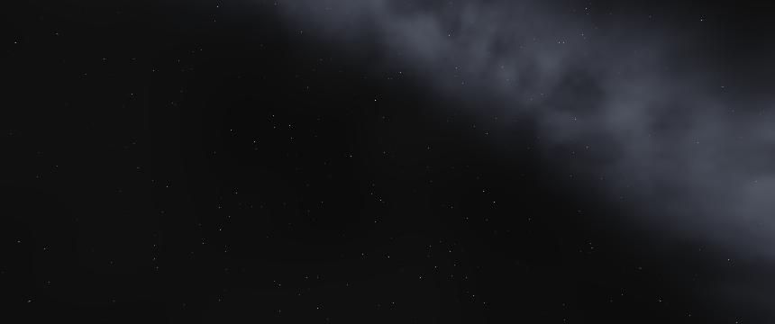

# Stellar glow visibility correction

2026-09-12. **VISUAL ARTIFACT CORRECTION CANDIDATE — READY FOR MANUAL ACCEPTANCE.**
Technical judgment: PASS. UNBANKED; physical confirmation remains required.
M14 stays open; no milestone assigned.

## Baseline and physical evidence

Starting worktree was clean on main. HEAD/main/origin/main and
`m14.17-certified-continuation-publication^{}` resolve to
`a890a12c5cfb6c1eb4ee15906a21161bc4930988`. Implementation branch:
`codex/stellar-glow-visibility`, created after controlled raster isolation.

Original video: `E:\Videos\2026-09-11 19-46-42.mp4`, 3440x1440,
60 FPS, 57.152 seconds. SHA256:
`EF844B7D769ED8124A5EB61F0274EF5F64BD6930653C4D0282B322C37A75AF16`.
Original log:
`C:\Users\Tyler\Downloads\ENovaCoresamplesNovaCore.TrianglebinReleasenet10.0NovaCore.Triangle.exe.txt`.
SHA256: `CC3E879B6969829FD0E067EE86B54EDBF299394E0F7923A9A7B8398BF6FBAD11`.
Both originals remain in place, unmodified; not duplicated into Git.

The log identifies Solar/Florida, current-epoch Release on RX 6800 XT,
3440x1440, HDR format 97. Recorded managed DLL SHA256:
`a42cce0438790edcbe6aaa5e77529799f81c26862f8c6d9486d88aecf3a7b569`.
Native DLL SHA256:
`62594a23368d008963011aa79fe1d385ccc863976d6014dc79f5cc6dacd5997b`.
The rebuilt candidate native DLL has that same identity. Its managed DLL is
`6f9a7a03ab14d5c899714f59cc3a6fd57aa81575382ce8db6e803b3865c4b223`;
no managed production source changed, but identical historical managed build
identity is not claimed.

The video shows a warm detached dot moving against the firmament. Exact historical
camera orientations were not recorded. The following are reproducible controlled
poses, not reconstructed video-frame orientations. Physical acceptance must confirm
that this proven rendering defect accounts for the user's original observation.

## Winning owner and coordinate contract

`stellar_glow.vert` divided clip XY by `abs(w)`, then forced homogeneous W=1
and Z=0. A Sun behind the camera consequently generated a visible halo in the
wrong hemisphere. Actual Sun geometry retains homogeneous clipping; solar markers
reject nonpositive W. Background alone does not generate the isolated light.

`SolarSystemScene.BodyCameraRelative` subtracts camera root position in FP64,
then `EncodedPosition.Encode` splits the result into presentation high/low fields.
`CameraRenderSnapshotBuilder` supplies projection times inverse orientation with
no camera translation; GPU camera position is zero in this path. The halo and
Sun consume the same camera-relative fields. There is no double subtraction or
second coordinate convention. Only the Sun receives stellar flag `0x20000000`;
ten celestial presentations do not imply ten admitted halos.

Native draw ownership is background, orbit overlays, halo, opaque planetary/terrain
geometry, Sun geometry and markers/labels. Halo uses alpha blending in the HDR pass
without depth testing; later opaque geometry covers it. No draw ordering, depth,
lighting or occlusion policy changed. Orbit/label shaders were source-audited;
they are not included in the four-pipeline raster fixture. Isolating background,
halo, Sun and marker already reproduces the defect without those overlays.

Classification: **CELESTIAL-DIRECTION-LOCKED, incorrectly projected into the rear
source's reflected screen direction**. It is neither a fixed screen pixel nor
an independent celestial object. Camera rotation changes clip XY/W, explaining
motion and orientation dependence. Existing warm radiance and minimum apparent
extent explain its color and persistent small size, but are not its cause.

## Causal isolation and motion witnesses

Fixture: camera at root origin, Sun at (0,0,+149600000000) metres, radius
695700000 metres, camera-relative high/low transport, reversed infinite projection,
860x360 viewport. Yaw/pitch in radians. Sun and marker projected centers use signed
W but are clipped in rear poses. The erroneous halo uses absolute W.

| Pose | Yaw / pitch | Clip W | Signed Sun/marker pixel | Old halo pixel | Measured artifact centroid | Old/new changed pixels |
|---|---|---|---|---|---|---|
| 0 | 0 / 0 | -1.496e11 | 430,180 (clipped) | 430,180 | 430,180 | 64 / 0 |
| 1 | .2 / .1 | -1.45885e11 | 366.484,148.719 (clipped) | 493.516,211.281 | 493.515,211.327 | 60 / 0 |
| 2 | -.3 / -.2 | -1.40069e11 | 528.403,243.199 (clipped) | 331.597,116.801 | 331.597,116.758 | 62 / 0 |

The artifact follows the erroneous projection within 0.05 pixel. Removing only
the halo makes the rear full image exactly equal to the background float buffer;
Sun and marker contribute zero pixels there. At 3440x1440 the corresponding rear
pixel counts are 933/948/971 before, zero after; pose 1 centroid is
1974.06,845.126 versus predicted 1974.06,845.125.

Front poses 4 and 5 retain identical linear-HDR hashes before/after, respectively
11901088398779466341 and 11430145551605971388 (test FNV64 over float bits).
Background hashes remain identical at every pose. The full pose rows are in
[results.json](results.json). Hashes corroborate deterministic comparisons; the
permanent rear test compares complete float arrays directly.

Controlled pose 1, before / after (860x360). PNGs use the witness's fixed display
mapping of linear HDR, not production tone mapping. The underlying comparisons
are made before that mapping.




## Correction and visibility

Only production execution change: reject non-stellar or nonpositive projected W
before halo projection; divide by signed positive W. No arbitrary camera-angle,
brightness, size, alpha or color threshold. Behind-camera and zero-depth centers
produce no halo. Front-facing centers use exactly the Sun projection. A halo may
overlap the viewport with its center just outside it; ordinary quad clipping
handles that. A wholly off-frustum quad produces no pixels. Existing planet
occlusion by subsequent opaque rendering remains in force; dynamic occultation
still belongs to physical acceptance.

The `.012` minimum extent, angular law, Sun radiance, fragment shaders, stars,
Milky Way, tone map, HDR, planetary lighting and camera authority are unchanged.
One existing draw remains, six vertices per submitted presentation with only one
stellar instance admitted. Rear work is rejected at the vertex stage; no new pass,
readback, CPU submission or runtime diagnostic hook was added. Warp changes
celestial state but does not multiply this per-rendered-frame responsibility.

## KSA responsibility comparison

**ADAPT** current KSA's shared camera-relative Sun source and forward visibility.
Inspected local `E:\Kitten Space Agency\` implementation, including current KSA
Program's Sun setup (decompiled source at
`build/ksa-residency-reference/assembly-source/KSA/Program.cs:2781-2807`), and
`Content/Core/Shaders/PostProcess/sunbloom.frag` / `sunbloom_blur.comp`.
Installed KSA assembly SHA256:
`A8A5164204EED962DF9D9025E99F523D9A23EE2CE6E802B18216A9DA35506D2F`.
KSA derives Sun lighting and presentation from the same ego-relative vector,
projects with signed W and supplies a nonnegative forward Sun dot; bloom uses
forward admission and Sun-depth occlusion. Background stars are independent.
NovaCore keeps its existing compact halo and opaque draw-order occlusion rather
than importing KSA's flare render targets. No appearance copy or new flare system.
KSA cost was not measured; no historical chronology is needed to settle this defect.

## Permanent regression and validation

`StellarProjectionTests.cpp` executes actual production background/halo/Sun/marker
SPIR-V offscreen: 24 distance/orientation cases plus disabled-instance and zero-W
controls. Distances are 5e9, 1.496e11 and 4e12 metres. Rear visibility, full
off-frustum rejection, signed front centroid and background isolation are asserted.
The test fails against the banked shader with `rear-facing stellar glow leaked
into sky` (exit 1); corrected Debug and Release pass. The fixture uses a sphere
mesh for the Sun, not the full scene's planet/terrain occlusion workload.

The shared GPU test helper now accepts graphics queue and buffer-usage requirements;
existing compute-test defaults are unchanged. Graphics `--native-gpu` includes the
new executable. Explicit `--witness` mode preserves compact reproduction capability
without normal-runtime dependencies; default mode always enforces regression checks.

- Full Debug and Release solution builds: PASS, zero warnings/errors.
- Final native GPU suite: Debug 3/3 and Release 3/3 PASS, no skips; Khronos-only
  canonical discovery, strict validation. SDK 1.4.357.0 validation DLL SHA256
  `9725CE7A9225F42F8961C433DACAE4CC8FAE3A16E95EF1D0A7C7E8BC09132C40`.
- Six affected managed Graphics cases per configuration: PASS. Solar presentation
  and focus; Earth material continuity; distant quaternion parity; camera relative;
  transport layout; Solar bounded-domain camera regression. These cover Earth,
  Sun and non-Earth presentation/marker ownership.
- Release Solar overview: 40 frames, exit 0.
- Debug and Release bounded Solar warp traversal: 215 frames each, exit 0. Earth
  surface/retreat, Moon and Sun; all five rate regimes, pause and resume; zero
  authority mismatches, independent failures or nonfinite frames. Debug strict
  Vulkan validation passed. Release is normal shipping diagnostic behavior.
- Independent body/orbit camera error max .01746928 m; screen error max
  5.303682e-9 NDC Debug, 6.357695e-9 Release. No production precision change.
- Old glow SPV SHA256 `30A9ED63E3D92581852AFEF62A242F2160A10C6CDB276A3B1AA0360A476183E8`.
  Corrected SPV SHA256 `43463716AD81D7C913273D498B6F46A00CFD8A877E2C000D31FA66D5742CF1F8`
  matches both native build trees and both deployed Triangle configurations.

## Bounded cost and headroom limits

RX 6800 XT, 3440x1440 offscreen R32G32B32A32 HDR, 16 warmup draws and 128
samples per fixed pose per arm. Timestamp queries surround the four production
shader pipelines; readback is outside the GPU timing. Values below are
**median / P95 / P99 / max in milliseconds**.

| Pose / shader | Background | Glow interval | Total isolated GPU pass | CPU submission |
|---|---|---|---|---|
| Rear / banked | .69640 / .80368 / .80448 / .80508 | .00008 / .00012 / .00012 / .00024 | .70048 / .83228 / .89544 / .92140 | .0220 / .0446 / .0634 / .0690 |
| Rear / corrected | .78212 / .80348 / .80436 / .80456 | .00012 / .00012 / .00012 / .00016 | .78932 / .87728 / .97840 / .99652 | .0225 / .0622 / .0804 / .0961 |
| Front / banked | .66436 / .67476 / .67576 / .67584 | .00008 / .00012 / .00016 / .00024 | .66816 / .76376 / .83152 / .84988 | .0215 / .0537 / .0636 / .0879 |
| Front / corrected | .72368 / .74196 / .74500 / .74584 | .00012 / .00012 / .00016 / .00036 | .72884 / .80120 / .89484 / .89684 | .0221 / .0573 / .0828 / .0841 |

The unchanged background also shifts between runs. The isolated total is higher
by .061-.089 ms at median; those observations must not be erased or attributed
to a particular clock/scheduling cause without telemetry. Tiny glow intervals are
near timestamp resolution and are not reliable nanosecond shader-cost estimates.
No added pass or CPU work exists, but this experiment does not establish a precise
whole-frame delta or certify the 6.67 ms display-frame target.

Normal Release automated traversal reports frame pacing p50 5.507, P95 7.051,
P99 28.963, max 128.921 ms over 215 frames; average GPU .355 ms and background
.093 ms. Startup/transitions are included, viewport was not the incident's verified
native extent, and render-loop timing is not actual displayed cadence. No historical
or physical displayed-cadence measurement is available. Do not claim sustained
150 FPS acceptance from this smoke or the isolated pass. No unrelated terrain
optimization was undertaken.

## Reproduction and physical acceptance

Use the repository's MSVC Developer shell and canonical Vulkan validation recipe
in [build-windows](../../build-windows.md). Build `NovaCoreStellarProjectionTests`
in `build/native-ninja` and `build/native-ninja-release`, then run each Graphics
test executable with `--native-gpu`.

For the historical witness, export the baseline shader using `git show
a890a12c5cfb6c1eb4ee15906a21161bc4930988:native/NovaCore.Native/shaders/stellar_glow.vert`
to a disposable UTF-8 `.vert` file and compile using the CMake `glslc` command
(no extra flags). Do not replace the deployed module. Run:

```text
NovaCoreStellarProjectionTests.exe <old-or-current-glow.spv> --witness <native-build>/shaders <disposable-output-prefix>
```

This emits six pose rows and six PPMs. Optional `--timing` uses 3440x1440 and the
same bounded 16+128 cost recipe. Default invocation with only a shader path enforces
the gate; other production shader modules must be alongside it. Reproduce through
canonical layer discovery, with Khronos enabled, no ambient third-party layers.
No historical dump or copied observer implementation is needed.

Physical route: normal launcher, **Florida Launch Site / Fullscreen Native /
Normal Diagnostics**, using the rebuilt Release deployment and current epoch.
Runtime route is `--scene=sol --focus=earth --surface-site=florida-launch` plus
the launcher's selected display settings. Keep the original video available.

1. Follow the original camera movement as closely as possible; move near the site.
2. Attach/detach with E; slowly orbit Earth and make large yaw/pitch rotations.
3. Put Earth between the camera and Sun where practical; check opaque occultation.
4. Bring the real Sun into and out of the viewport; check halo/disc alignment,
   continuous clipping, markers and absence of a second warm dot.
5. Use R for Solar overview; focus Sun, Moon and Earth; return close to Earth.
6. Confirm stars/Milky Way, terrain and lighting retain quality and no new popping
   or camera-following light appears. Exit normally and return observations/log.

Physical acceptance is PENDING. The runtime's pre-existing `manualAcceptance=passed`
Earth-policy line refers to older accepted terrain work, not this visual correction.
Do not bank this candidate before Project Control accepts the physical result.

## Adversarial review and evidence lifecycle

Strongest alternative: a background star or duplicate marker could resemble the
video dot. Rear full-minus-halo equals background exactly, the Sun/marker path
contributes zero there, and centroids follow the old projection. This rejects those
owners for the controlled defect; missing historical orientations limit exact
video-frame reconstruction. Physical confirmation closes that remaining link.

Front quality objection: rejecting an arbitrary angle could remove valid glow.
The guard is homogeneous front visibility, not an empirical angle. Signed front
projection and complete HDR hashes are preserved; fully off-frustum and disabled
controls pass. No new occlusion policy was inferred from the offscreen fixture.

Retain this report, structured results and two small PNG witnesses. Temporary
`build/stellar-artifact` contains 102 files / 196,832,188 bytes, all generated for
this investigation and reproducible through the retained native test. Its disposal
is recorded in `storage.json`; original video/log and ordinary deployed build
outputs are excluded. No staging, commit, push or tag is authorized.

Automatic deletion was rejected before execution with `blocked by policy`; no
retry was made. Disposed: 0. Remaining disposable: 102 files / 196,832,188 bytes.
Reviewed manual cleanup, after retaining this package:

```powershell
Remove-Item -LiteralPath 'E:\NovaCore\build\stellar-artifact' -Recurse -Force
```

`git diff --check` passes (line-ending warnings only). Nothing staged. HEAD,
main, origin/main and the M14.17 tag target remain at the baseline above.
